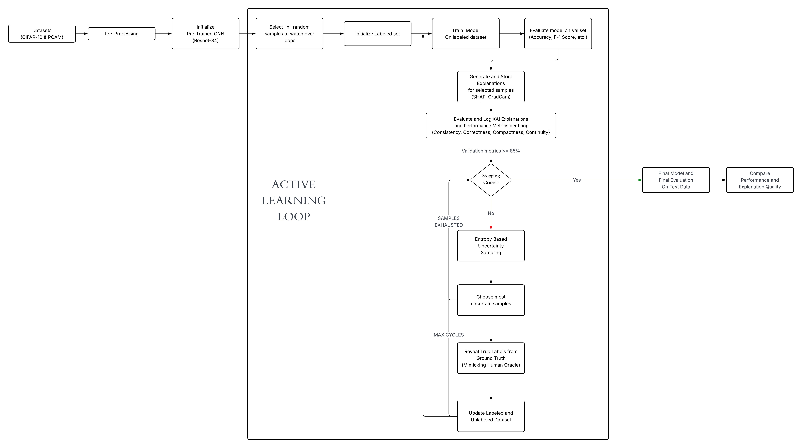

# Explainable Active Learning (XAL)

This repository contains the full implementation used in the thesis **Explainable Active Learning**, which investigates how explanation quality evolves across Active Learning cycles. The framework integrates Active Learning, deep learning, and Explainable AI (XAI) to study both model performance and explanation dynamics.

---

## Overview

The project examines how explanations produced by different XAI methods change as a model progressively learns from the most informative samples. The experiments are performed on two datasets (PCAM and CIFAR-10) using:

- Entropy-based Active Learning
- ResNet-34 classification model
- SHAP (GradientSHAP) and GradCAM++
- Functionally grounded XAI metrics (Quantus)
- Cycle-by-cycle tracking of explanations

The goal is to evaluate whether explanation quality improves alongside model performance during the AL process.

### Methodology 

---

## Datasets

### PCAM (PatchCamelyon)
- Binary classification (tumor vs. non-tumor)
- 96×96 histopathology image patches
- Balanced dataset
- Subset used for computational feasibility

### CIFAR-10
- 10-class natural image dataset
- 32×32 RGB images
- Used to compare AL + XAI behavior in natural vs. medical data

---

## Active Learning Workflow

The Active Learning loop follows these steps:

1. **Initial Labeled Set**  
   - 2000 stratified samples (≈5% of dataset)

2. **Model Training**  
   - ResNet-34  
   - 30 epochs for cycles 1–5  
   - 20 epochs for later cycles  

3. **Query Strategy**  
   - Entropy-based uncertainty sampling  
   - Select top 100 highest-entropy samples per cycle

4. **Dataset Update**  
   - Add queried samples to the labeled pool  
   - Retrain and repeat

5. **Explanation Tracking**  
   - Generate SHAP and GradCAM++ for the same 100 fixed validation images each cycle

All results, checkpoints, and explanation maps are saved per cycle.

---

## Explainability Methods

### GradientSHAP
- Pixel-level attribution method from Captum
- Combines integrated gradients with stochastic baselines
- Produces fine-grained saliency maps

### GradCAM++
- Region-based explanation technique
- Uses weighted gradients from the last convolutional layer
- Highlights class-relevant spatial regions

Both methods are applied at every AL cycle.

---

## XAI Evaluation Metrics

Using **Quantus**, the following functionally grounded metrics are computed:

- Continuity  
- Compactness  
- Correctness  
- Consistency  
- XAI Quality Score (XQS)

Metrics are reported per cycle for both datasets and both explanation methods.

---

## Model Evaluation Metrics

- Accuracy (CIFAR-10)
- Recall and AUC-ROC (PCAM)
- Precision
- F1-Score

These evaluate classification performance across AL cycles.

---

## Experiments

The following experiments are included:

1. **Baseline performance**  
2. **Cycle-by-cycle XAI metric evolution**  
3. **Sensitivity analyses**  
   - PCAM: Gaussian noise perturbation  
   - CIFAR-10: Rotational perturbation  

Results include both model performance and explanation quality trends.

---

## Reproducibility

The framework ensures consistent and reproducible experiments through:

- Fixed random seed (42)
- Stored stratified splits for all datasets
- Tracking the same 100 validation images per cycle
- Deterministic preprocessing and sampling routines

---

